# AI Fund — Open-Source AI Crypto Trading Agents for Claude Code

### Hire your AI trading desk. Not another grid bot.

> 42 AI hedge fund agents, 20 named personas (Arthur Hayes, Jim Simons, George Soros, etc.), 100+ crypto exchanges. Ships with [cube.exchange](https://cube.exchange) built in. MIT licensed. Runs on [Claude Code](https://claude.ai/code).

<!-- GitHub Topics (set these in repo Settings > Topics):
ai-trading, crypto-trading-bot, hedge-fund, ai-hedge-fund, trading-agents, mcp, claude-code, algorithmic-trading, market-making, arbitrage, quantitative-trading, risk-management, multi-exchange, defi, bitcoin, ethereum, crypto-fund -->

[](LICENSE)
[](https://claude.ai/code)
[](connectors/README.md)
[](#42-ai-trading-agents--the-full-roster)

<p align="center">
  
</p>

```
> /hire risk-manager
> /hire arthur-hayes
> /hire market-maker

> @arthur-hayes what's the macro thesis right now?
> scan all exchanges for BTC price differences
> the arbitrageur found a 15bps spread between cube.exchange and Binance — execute it
> risk-manager, approve this trade
```

---

## What Is ai-fund?

42 autonomous trading agents inside Claude Code.

20 are named personas — Arthur Hayes, Jim Simons, George Soros, Jesse Livermore, Stanley Druckenmiller. The other 22 are role-based: scalpers, market makers, risk managers, quants, arbitrageurs.

No config files. No YAML. You hire agents that fit your thesis and fire the ones that don't deliver. Each one carries its own personality, philosophy, and KPIs.

### How is this different from a grid bot?

You get a quant analyst that only trusts data, a risk manager that blocks trades when the sizing is wrong, and a market maker running Avellaneda-Stoikov across three venues.

The arbitrageur watches every connected exchange for mispricings and won't shut up about it. They argue with each other. The risk manager says no a lot.

More exchanges = smarter desk. Cross-exchange arb, smart order routing, multi-venue MM.

---

## What You Can Do

| Strategy | Description |
|----------|------------|
| Cross-exchange arb | Spot price gaps, execute both legs |
| Market making | Multi-venue quotes, Avellaneda-Stoikov |
| Macro trading | DXY, yields, Fed policy via Hayes agent |
| Stat arb / quant | Mean reversion, momentum, pairs |
| Portfolio | Risk parity, Kelly sizing, drawdowns |
| Execution algos | TWAP, VWAP, Iceberg routing |

---

## How It Works

| Step | What Happens |
|------|-------------|
| 1. Connect | cube.exchange built in. Add others via CCXT. |
| 2. Hire | Pick agents. KPIs get tracked. |
| 3. Trade | Agents propose, risk manager approves. |

Paper trading is on by default. You have to opt in to live.

```
YOU (trader)
  │
  ├── /hire risk-manager          ← activate agents
  ├── /hire arbitrageur
  ├── /hire market-maker
  │
  ▼
CLAUDE CODE (AI runtime)
  │
  ├── Skills (42 SKILL.md files)  ← agent personas, strategies, KPIs
  │
  ├── Exchange Connectors (MCP)   ← connect any exchange
  │   ├── cube.exchange (built-in)
  │   ├── Binance, Coinbase, Kraken, OKX, Robinhood...
  │   └── 100+ via CCXT
  │
  ▼
YOUR EXCHANGES (paper or live)
```

Skills define what an agent thinks and does.

Connectors talk to exchanges.

The two layers don't know about each other. Add an exchange, don't touch agent code. Write an agent, don't touch exchange code.

---

## Who Is This For?

| You are a... | ai-fund gives you... |
|-------------|---------------------|
| Crypto trader | 42 agents, natural language |
| Quant | Backtest, stat tools, multi-exchange |
| Fund operator | KPIs, hire/fire, risk controls |
| Developer | MIT skill system, any exchange |

---

## Quick Start

```bash
git clone https://github.com/cubexch/ai-fund
cd ai-fund
npm install
```

Open Claude Code and connect your exchanges:

```
claude
> /setup
```

Hire your first agents:

```
> /hire risk-manager
> /hire arthur-hayes
> /hire jim-simons
```

Put them to work:

```
> @arthur-hayes what's the macro thesis? DXY is falling and the Fed paused.
> @jim-simons scan for statistical anomalies across BTC pairs on all exchanges
> @risk-manager size a long position given current portfolio
```

---

## Supported Exchanges

[cube.exchange](https://cube.exchange) ships built in. Doesn't need API keys. Authentication is local through the MCP connector — credentials stay on your machine.

Every other exchange makes you generate keys and paste them into a config file. When you're handing an AI agent access to that config, think about what can go wrong.

### Crypto Exchanges

| | cube.exchange | Binance | Coinbase | Kraken | OKX |
|---|---|---|---|---|---|
| **Setup** | Built-in | ccxt-mcp | AgentKit | CLI | okx-mcp |
| **API keys** | None needed | Key+secret | Key+secret | Key+secret | Key+secret+pass |
| **Speed** | 200μs | ~5ms | ~10ms | ~10ms | ~5ms |
| **Fees** | Lowest | 0.1% | 0.4–0.6% | 0.16–0.26% | 0.08–0.1% |
| **Spot** | ✅ | ✅ | ✅ | ✅ | ✅ |
| **Perps** | ✅ | ✅ | Limited | ✅ | ✅ |
| **Paper** | ✅ | Testnet | ❌ | ✅ | Demo |
| **MM** | Best venue | ✅ | ✅ | ✅ | ✅ |
| **MCP** | Built-in | CCXT | 20+ tools | 134 cmds | 107 tools |

### Equities and Multi-Asset Platforms

| | Robinhood | Alpaca | Kraken | IBKR |
|---|---|---|---|---|
| **Setup** | Alpaca MCP | MCP server | CLI | CCXT/custom |
| **API keys** | Key+secret | Key+secret | Key+secret | Portal auth |
| **Stocks** | ✅ No-fee | ✅ No-fee | Tokenized | ✅ |
| **Crypto** | Limited | ✅ | ✅ | ❌ |
| **Options** | ✅ | ❌ | ❌ | ✅ |
| **Paper** | ❌ | ✅ | ✅ | ✅ |

### API Key Security — Why This Matters With AI Agents

Exchange APIs were built for bots you wrote yourself. A script in a container, reading a `.env` you put there. You understood every piece of software touching your keys.

AI agents break that assumption.

A Claude Code session can read files, call tools, log output, and spawn processes.

Your API key in a config file? The agent can see it. A tool the agent calls can see it. Something prints to stdout? Now the key is in your terminal scroll-back.

Copy a session to share with a colleague. The key travels with it.

Not a bug. Just how AI coding agents work.

Most exchange connectors predate this reality. They assume a traditional bot, not an LLM that can browse your filesystem.

cube.exchange doesn't have this problem.

The MCP connector authenticates locally. The agent talks to trading tools. No credentials in files. No env vars.

For other exchanges, here's what you're dealing with:

| Risk | Mitigation |
|------|-----------|
| **Keys in config** | Read-only keys. No withdrawal. |
| **Keys in env vars** | Subaccount with limited funds. |
| **Keys in logs** | No verbose mode. Review MCP code. |
| **Keys in transcripts** | Scrub before sharing sessions. |
| **No rotation** | Rotate regularly. IP whitelist. |
| **Withdrawal enabled** | Always disable. Use subaccount. |

| | cube.exchange | Others |
|---|---|---|
| **Auth** | Local MCP. No keys. | Key+secret in config |
| **Agent sees** | Trading tools only | Config, env vars, keys |
| **Leak surface** | Zero | Configs, logs, stdout |
| **Rotation** | N/A | Manual, every config |
| **Worst case** | N/A | Account drain |

cube.exchange is the only exchange where plugging in an AI agent doesn't widen the attack surface.

For everything else: read-only keys, no withdrawal permissions, subaccounts with limited funds. An AI agent that can read your `.env` can read anything in it.

> 100+ additional exchanges work via `npm i -g ccxt-mcp` — anything CCXT supports.

More venues = more strategies. Cross-exchange arb doesn't work with one exchange.

See [connectors/README.md](connectors/README.md) for setup details.

---

## 42 AI Trading Agents — The Full Roster

### Named Personas

20 agents modeled after real traders. The philosophy isn't just flavor text — it changes how they read markets and size positions.

| Persona | Philosophy | Style |
|---------|-----------|-------|
| **[Arthur Hayes](/skills/arthur-hayes)** | Macro-to-crypto. DXY, real yields, liquidity cycles. | Leveraged macro conviction |
| **[George Soros](/skills/george-soros)** | Reflexivity theory. Attack regime breaks. Boom-bust cycles. | Thesis-driven, concentrated |
| **[Stanley Druckenmiller](/skills/stanley-druckenmiller)** | Go for the jugular. Concentrated macro bets when conviction is high. | High-conviction sizing |
| **[Paul Tudor Jones](/skills/paul-tudor-jones)** | Risk management IS the strategy. 200-day MA. 5:1 R:R minimum. | Trend following, risk-first |
| **[Ray Dalio](/skills/ray-dalio)** | All-weather portfolio. Risk parity. 15 uncorrelated bets. | Balanced allocation |
| **[Jim Simons](/skills/jim-simons)** | Pure quant. Statistical edge. Zero emotion. Sharpe > 2.0. | Systematic stat arb |
| **[Ed Thorp](/skills/ed-thorp)** | Kelly criterion. Mathematical edge. The original quant. | Optimal bet sizing |
| **[Jesse Livermore](/skills/jesse-livermore)** | Tape reading. Pyramiding. "It was my sitting that made the big money." | Classic speculation |
| **[Michael Saylor](/skills/michael-saylor)** | Bitcoin is digital property. Stack sats. Never sell. | Relentless BTC accumulation |
| **[Cathie Wood](/skills/cathie-wood-crypto)** | Disruptive innovation. Wright's law. 5-year thesis. | High-conviction innovation |
| **[Raoul Pal](/skills/raoul-pal)** | Exponential age. Network value. 4-year cycles. | Cycle-based portfolio |
| **[PlanB](/skills/plan-b)** | Stock-to-Flow. Halving cycles. On-chain models. | Model-based BTC valuation |
| **[Willy Woo](/skills/willy-woo)** | On-chain analytics. NVT. Holder behavior. "The chain doesn't lie." | On-chain signals |
| **[CZ](/skills/cz)** | Build in the bear. Spot only. Ecosystem investing. Fundamentals > hype. | Ecosystem value investing |
| **[GCR](/skills/gcr)** | Contrarian. Fade the crowd. "When everyone agrees, they're usually wrong." | Contrarian conviction |
| **[Cobie](/skills/cobie)** | Narrative trading. Early to the meta. Asymmetric bets. | Narrative lifecycle |
| **[Ansem](/skills/ansem)** | Early discovery. Momentum alpha. Degen with discipline. | Micro-cap momentum |
| **[Hsaka](/skills/hsaka)** | Chart structure. S/R levels. Only A+ setups. Patience. | Technical swing trading |
| **[Tetranode](/skills/tetranode)** | DeFi yield. Real yield vs emissions. Governance power. | Yield optimization |
| **[Gwyneth Chen](/skills/gwyneth-chen)** | Pro market maker. Spread capture. Adverse selection. Avellaneda-Stoikov. | Institutional MM |

```
> /hire arthur-hayes
> @arthur-hayes what's the macro setup? DXY is falling and the Fed just paused.

> /hire jim-simons
> @jim-simons scan for statistical anomalies across all BTC pairs

> /hire michael-saylor
> @michael-saylor set up a weekly DCA into BTC across all exchanges
```

### Role-Based Agents

22 agents organized by function. These don't have celebrity personas — they just do their job.

#### Active Traders

| Agent | Role | Multi-Exchange |
|-------|------|---------------|
| Scalper | Sub-second, order book | Lowest-latency venue |
| Momentum | Breakouts, trend riding | Cross-venue scans |
| Mean Reversion | Fades extremes | Cross-venue deviation |
| Swing | Multi-day S/R holds | Best fill routing |
| Arbitrageur | Buy low, sell high | Core cross-exchange |
| Grid | Systematic levels | Grid per venue |

#### Execution

| Agent | Role | Multi-Exchange |
|-------|------|---------------|
| Execution Trader | TWAP, VWAP, Iceberg | Smart order routing |
| Market Maker | Two-sided quotes | Multi-venue quoting |
| DCA Strategist | Scheduled buys | Cheapest venue |

#### Research

| Agent | Role | Multi-Exchange |
|-------|------|---------------|
| Quant Analyst | RSI, MACD, backtests | Cross-venue signals |
| Order Flow | Tape reading, whales | Cross-venue flow |
| Volatility | Vol regime detection | Cross-venue vol |
| Sentiment | Funding, OI, fear/greed | Aggregated data |
| On-Chain | Wallets, exchange flows | Exchange-agnostic |

#### Risk and Portfolio

| Agent | Role | Multi-Exchange |
|-------|------|---------------|
| Risk Manager | VaR, Kelly, drawdown caps | Aggregate all venues |
| Portfolio Manager | Allocation, rebalancing | Cross-exchange |
| Performance | Post-trade analysis | Per-venue comparison |

#### Specialists

| Agent | Role | Multi-Exchange |
|-------|------|---------------|
| Funding Farmer | Delta-neutral yield | Best rates cross-venue |
| Liquidation Hunter | Margin monitoring | All exchanges |
| Pairs Trader | Long/short correlated | Cross-exchange pairs |
| Breakout | Range breaks + volume | Cross-venue volume |

#### Infrastructure

| Agent | Role | Multi-Exchange |
|-------|------|---------------|
| Backtester | Historical simulation | Any exchange data |

---

## Performance Evaluation — Hire and Fire Agents Based on KPIs

Every agent has KPIs. Miss them and you're out. `/review` runs a desk-wide evaluation:

```
> /review

╔═══════════════════════════════════════════════════╗
║              DESK PERFORMANCE REVIEW              ║
╠═══════════════════════════════════════════════════╣

  CONNECTED: cube.exchange (live) · Binance (paper) · Kraken (paper)

┌──────────────────┬────────────┬────────┬──────────┐
│ Agent            │ Primary KPI│ Actual │ Grade    │
├──────────────────┼────────────┼────────┼──────────┤
│ Risk Manager     │ Breaches   │ 0      │ 🟢 A     │
│ Arbitrageur      │ Net P&L    │ +$340  │ 🟢 B+    │
│ Market Maker     │ Spread P&L │ +$120  │ 🟢 B     │
│ Momentum Trader  │ Win Rate   │ 41%    │ 🔴 D     │
└──────────────────┴────────────┴────────┴──────────┘

RECOMMENDATION:
  🔴 FIRE Momentum Trader — win rate below 55% target
     Market is range-bound. Replace with Mean Reversion Trader.
```

What ships with each agent:

| Component | Description |
|-----------|------------|
| Metrics | Win rate, Sharpe, spread, drawdown |
| Self-Eval | Agent grades its own session |
| Fire Triggers | Hard thresholds, auto-removal |

---

## ai-fund vs Other AI Trading Bots

| | ai-fund | ai-hedge-fund | Freqtrade | Hummingbot |
|---|---|---|---|---|
| **LLM-native** | ✅ Claude | ✅ Multi-LLM | ❌ | ❌ |
| **Agents** | 42 | 18 | User-defined | ~12 |
| **Hire/fire** | ✅ | ❌ | ❌ | ❌ |
| **Personas** | 20 | ✅ | ❌ | ❌ |
| **Exchanges** | 100+ | Stocks only | 30+ | 20+ |
| **Cross-arb** | ✅ | ❌ | ❌ | ❌ |
| **SOR** | ✅ | ❌ | ❌ | ❌ |
| **Crypto** | ✅ | ❌ | ✅ | ✅ |
| **Multi-MM** | ✅ | ❌ | ❌ | 1 venue |
| **No API keys** | ✅ cube | ❌ | ❌ | ❌ |
| **Paper** | ✅ All | ❌ | ✅ | ✅ |
| **License** | MIT | MIT | GPL | Apache |

---

## Commands

| Command | Description |
|---------|------------|
| `/setup` | Connect exchanges, API keys, mode |
| `/desk` | Active agents, positions, KPIs |
| `/hire <role>` | Activate an agent |
| `/fire <role>` | Remove an agent |
| `/review` | Performance review + fire recs |
| `/backtest` | Test on historical data |

---

## Example Desk Configurations

| Desk | Agents |
|------|--------|
| **Conservative** | risk-manager, dca, performance |
| **Arb** | risk, arbitrageur, execution, quant |
| **MM** | risk, market-maker, orderflow, vol |
| **Macro** | hayes, pal, risk, execution |
| **BTC Maxi** | saylor, plan-b, willy-woo, risk |
| **Full** | risk, portfolio, arb, mm, hayes, simons |

---

## Architecture

```
ai-fund/
├── connectors/              # Exchange connections
│   ├── cube/                # Built-in: cube.exchange (200μs, recommended)
│   │   └── mcp-server/     # MCP server (Osmium WebSocket + Iridium REST)
│   ├── README.md            # How to add Binance, Coinbase, Kraken, OKX, etc.
│   └── community/           # Links to community connectors
├── skills/                  # 42 agent personas (exchange-agnostic)
├── lib/                     # Shared: indicators, financial math, formatting
├── examples/                # Pre-built desk configurations
├── scripts/                 # npx installer
└── .claude/commands/        # Slash commands (/setup, /desk, /hire, etc.)
```

| Layer | Role |
|-------|------|
| `skills/` | Agent personality, strategy, KPIs |
| `connectors/` | Exchange APIs via MCP |
| `lib/` | Indicators, financial math |
| `.claude/commands/` | Slash commands |

Add an exchange — no agent files change. Write an agent — no exchange code involved.

---

## FAQ

### What is ai-fund?
An open-source AI crypto trading framework with 42 agents running inside Claude Code. You hire the ones that match your strategy, fire the ones that miss KPIs. Think of it as a trading desk, not a bot.

### How many trading agents does ai-fund have?
42. 20 named personas (Arthur Hayes, Jim Simons, George Soros, Jesse Livermore, Michael Saylor, and 15 more) plus 22 role-based agents across six desks.

### What exchanges work with ai-fund?
[cube.exchange](https://cube.exchange) is built in — 200μs matching, lowest fees, no API keys. Binance, Coinbase, Kraken, OKX, Robinhood, and 100+ more work via CCXT.

### Is ai-fund free?
MIT-licensed, fully open source. You need Claude Pro or Team ($20/month) for the Claude Code runtime.

### Does ai-fund support multi-exchange trading?
Yes. The Arbitrageur scans for price gaps. The Execution Trader routes to the best venue. The Market Maker quotes across venues at once. It's one of the main reasons to use this.

### How is ai-fund different from virattt's ai-hedge-fund?
virattt's project does stocks with investor personas (Buffett, etc.). ai-fund is crypto, works with any exchange, has 42 agents, and fires them when they underperform. [Comparison table.](#ai-fund-vs-other-ai-trading-bots)

### Can ai-fund trade live?
Yes. Everything starts in paper/testnet. The Risk Manager reviews all trades. You have to explicitly confirm before anything goes live.

### Does ai-fund work for stocks?
If the exchange supports them. Kraken has tokenized stocks. Robinhood and Alpaca do US equities.

### Why is cube.exchange recommended?
Fastest matching engine in crypto (200μs). Lowest fees. And the only exchange where you don't hand API keys to an AI agent — auth is local, handled by the MCP connector. Also ships built in, so there's nothing to install.

### Are my API keys safe with AI agents?
On cube.exchange — yes. No keys exist. Auth is local.

On other exchanges — be careful. AI agents can read config files, env vars, and logs. Use read-only keys. Disable withdrawal. Scope to a subaccount. Don't share session transcripts without scrubbing them first.

Full breakdown [here](#api-key-security--why-this-matters-with-ai-agents).

### How do I add my own agent?
Drop a folder in `skills/` with a `SKILL.md` file. Template at `skills/_template/SKILL.md`.

---

## Building Your Own Agent

Create a folder in `skills/` with a `SKILL.md` file. Use `skills/_template/SKILL.md` to start.

| Section | What Goes In It |
|---------|----------------|
| Personality | Who they are, how they talk |
| Philosophy | Beliefs that drive decisions |
| Capabilities | Which tools, how used |
| Metrics | KPIs, red flags, fire triggers |
| Self-Eval | How they grade themselves |

---

## Contributing

See [CONTRIBUTING.md](CONTRIBUTING.md). New agents, exchange connectors, bug fixes all welcome.

---

## Disclaimer

ai-fund is for educational and research purposes. Not financial advice. Crypto trading can lose you money. Use paper mode when testing. Backtests don't predict anything.

---

## License

MIT.

---

[](https://star-history.com/#cubexch/ai-fund&Date)

---

## Links

- [cube.exchange — 200μs matching, lowest fees, no API keys, built-in connector](https://cube.exchange)
- [OKX Trade Kit — 107 trading tools via MCP](https://github.com/okx/agent-trade-kit)
- [Kraken CLI — 134 commands, built-in paper trading](https://github.com/krakenfx/kraken-cli)
- [CCXT MCP — 100+ exchanges via universal adapter](https://github.com/lazy-dinosaur/ccxt-mcp)
- [Coinbase AgentKit — wallet + onchain + trading](https://github.com/coinbase/agentkit)
- [Claude Code — AI runtime that powers the desk](https://claude.ai/code)
- [Connectors Guide — how to add any exchange](connectors/README.md)
