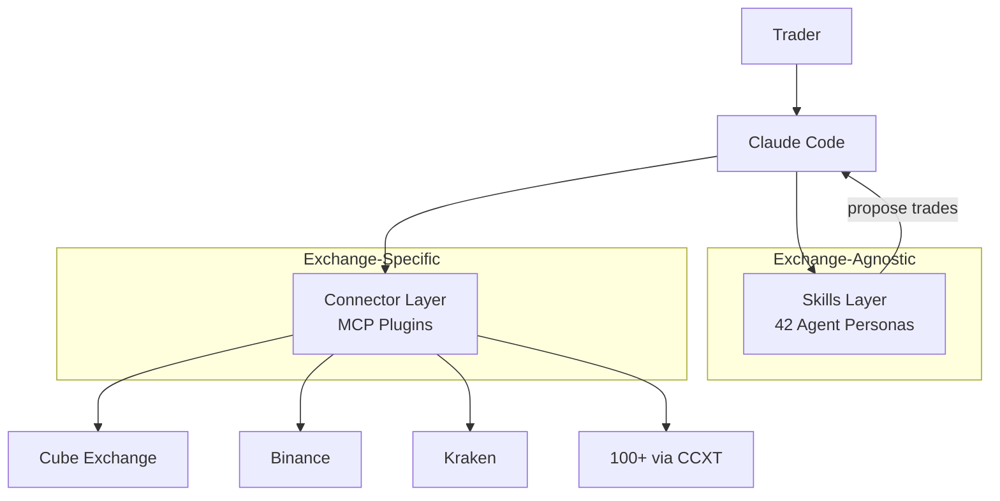
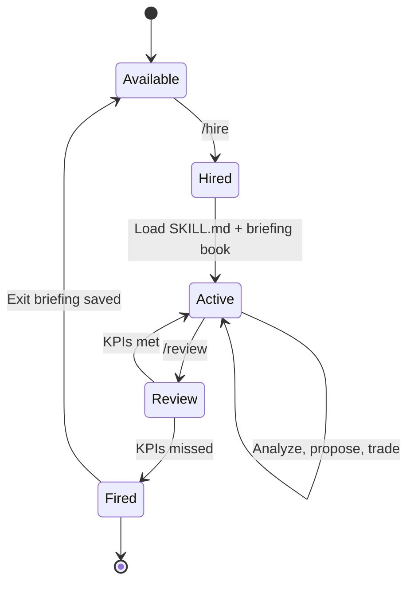
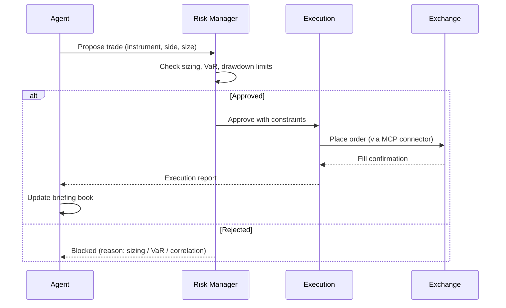
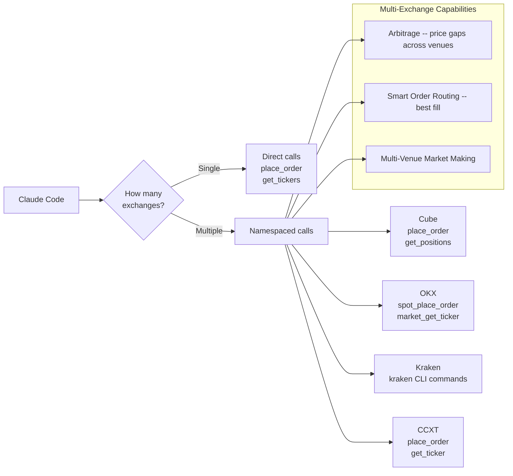
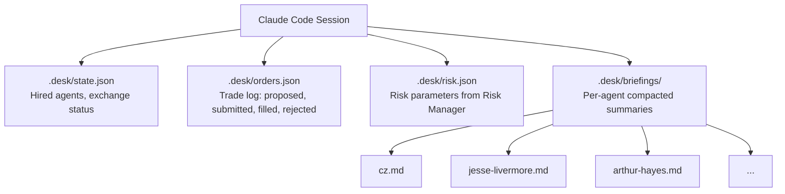
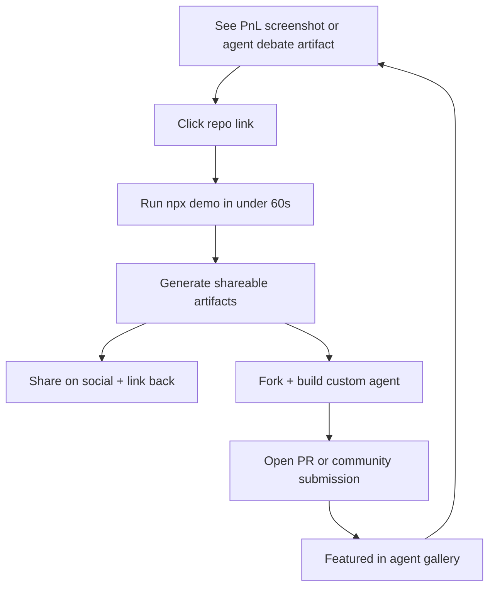

# Architecture

Visual reference for how AI Fund is structured, how agents move through their lifecycle, and how trades flow from idea to execution.

All diagrams use [Mermaid](https://mermaid.js.org/) and render natively on GitHub.

---

## System Architecture

The system has two independent layers: **Skills** (what agents think) and **Connectors** (how exchanges are reached). Adding an exchange requires no changes to agent code. Writing an agent requires no changes to exchange code.

Skills are `SKILL.md` files: personality, philosophy, strategy, KPIs. Connectors are MCP servers that translate generic tool calls (`place_order`, `get_tickers`) into exchange-specific API requests. The shared `lib/` layer provides technical indicators and financial math used by both.

---

## Agent Lifecycle

Agents are hired, perform work, get reviewed against KPIs, and are either kept or fired. Briefing books in `.desk/briefings/` persist context across sessions so a re-hired agent picks up where it left off.

Key transitions:

- **/hire** -- Loads the agent's `SKILL.md` and reads its briefing book from `.desk/briefings/<agent>.md`.
- **/review** -- Evaluates all active agents against their declared KPIs (win rate, Sharpe, drawdown, etc.).
- **/fire** -- Writes a final exit summary to the briefing book and deactivates the agent.

---

## Trade Flow

Every trade passes through the Risk Manager before reaching an exchange. No agent can place orders unilaterally. The Risk Manager checks position sizing, portfolio VaR, correlation limits, and exchange-level exposure.

The Execution layer handles order types (TWAP, VWAP, Iceberg) and smart order routing when multiple exchanges are connected.

---

## Multi-Exchange Tool Namespacing

When a single exchange is connected, tools are called directly. When multiple exchanges are connected via MCP, tools are namespaced so agents can target specific venues or scan across all of them.

More connected exchanges means more strategies become available. Cross-exchange arbitrage, smart order routing, and multi-venue market making all require two or more connectors.

---

## Desk State Persistence

Agent state, trade logs, and risk parameters persist between sessions in the `.desk/` directory. This is gitignored (per-user, per-account state).

---

## Contributor Growth Funnel

How new contributors discover, try, and contribute back to the project.

The loop is self-reinforcing: artifacts shared by existing users bring new users to the repo, who generate their own artifacts and contribute agents back.
