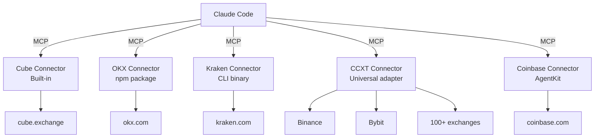

# Exchange Connectors

AI Fund connects to exchanges via MCP (Model Context Protocol) servers. Each exchange has its own connector that exposes trading tools. The 42 trading agents work with any connector — they use generic capabilities (place orders, get prices, manage positions) that every exchange MCP provides.

## Architecture



Each connector is an independent MCP server. When multiple connectors are active, tools are namespaced by exchange so agents can route to the right venue.

## Supported Exchanges

### Crypto Exchanges

| Exchange | Connector | Install | Auth | Paper Mode |
|---|---|---|---|---|
| **[Cube](https://cube.exchange)** | Built-in | Ships with repo | Local device login (no API keys) | Staging env |
| **[OKX](https://okx.com)** | `@okx_ai/okx-trade-mcp` | `npm i -g @okx_ai/okx-trade-mcp` | API key + secret + passphrase | Demo mode |
| **[Kraken](https://kraken.com)** | `kraken-cli` | [Install script](https://github.com/krakenfx/kraken-cli) | Browser login | Built-in paper |
| **[Binance](https://binance.com)** | `ccxt-mcp` | `npm i -g ccxt-mcp` | API key + secret | Testnet |
| **[Bybit](https://bybit.com)** | `ccxt-mcp` | `npm i -g ccxt-mcp` | API key + secret | Testnet |
| **[Coinbase](https://coinbase.com)** | `@coinbase/agentkit` | [AgentKit docs](https://github.com/coinbase/agentkit) | API key + secret | Not available |
| **[Hyperliquid](https://hyperliquid.xyz)** | Community MCP | [Search](https://github.com/search?q=hyperliquid+mcp) | Varies | Testnet |

### Equities, Multi-Asset, and 100+ More

Robinhood and Alpaca (via MCP), IBKR (via CCXT/custom), and any exchange supported by the [CCXT library](https://github.com/ccxt/ccxt) works via `ccxt-mcp` (`npm i -g ccxt-mcp`).

## Setup Instructions

### Cube Exchange (Built-In, Recommended)

Cube ships with the repo. No npm install needed. Auth uses device login with no API keys in files:

```bash
cd connectors/cube/mcp-server && npm run login
```

See [Agent Auth](agent-auth-brief.md) for how the Ed25519 device flow works.

### OKX, Kraken, and CCXT Exchanges

Each connector installs via npm or a dedicated binary and configures via `.mcp.json`. See the [Connectors README](../connectors/README.md) for per-exchange setup including API key configuration, paper mode options, and `.mcp.json` examples for OKX (107 tools), Kraken (134 commands), Binance, Bybit, and any CCXT-supported exchange.

## Tool Namespacing

When only one exchange is connected, tools are used directly (`place_order`, `get_tickers`). When multiple exchanges are connected, tools are namespaced:

| Exchange | Example Tools |
|---|---|
| Cube | `place_order`, `get_tickers`, `get_positions` |
| OKX | `spot_place_order`, `market_get_ticker` |
| Kraken | `place_order`, `get_ticker` (via CLI) |
| CCXT | `place_order`, `get_ticker` (per configured exchange) |

Agents understand namespacing automatically. The Arbitrageur scans all connected exchanges for price gaps. The Execution Trader routes to the venue with the best price.

## Multi-Exchange Strategies

Connecting multiple exchanges unlocks strategies that are impossible with a single venue:

| Strategy | How It Works |
|---|---|
| **Cross-exchange arbitrage** | Arbitrageur scans all venues for price discrepancies, buys cheap, sells expensive |
| **Smart order routing** | Execution Trader routes large orders to the exchange with deepest liquidity |
| **Multi-venue market making** | Market Maker quotes on multiple exchanges simultaneously |
| **Best execution comparison** | Compare fill quality across exchanges, route to the consistently best venue |
| **Cross-venue backtesting** | Backtester validates strategy across multiple exchange datasets |

More exchanges connected means a smarter, more capable desk.

## Building a Custom Connector

Any MCP server that exposes trading tools works with AI Fund's agents. To build a connector for a new exchange:

### Required Tools

Your connector must implement these tools at minimum:

| Tool | Purpose |
|---|---|
| `place_order` | Submit market and limit orders |
| `cancel_order` | Cancel an open order |
| `get_positions` | Current open positions |
| `get_balances` | Account balances |
| `get_tickers` | Current market prices |

### Recommended Tools

| Tool | Purpose |
|---|---|
| `get_price_history` | OHLCV candles for backtesting and analysis |
| `get_fills` | Trade history |
| `get_order_history` | Historical orders |
| `modify_order` | Amend an existing order |
| `mass_cancel` | Cancel all orders (used by Risk Manager in emergencies) |

### Reference Implementation

The Cube connector at `connectors/cube/mcp-server/` is a complete reference implementation. It uses Osmium WebSocket for market data and Iridium REST for trading.

### Steps to Add a Connector

1. Create an MCP server that wraps the exchange's API
2. Expose the required tools listed above
3. Package as an npm module or standalone binary
4. Add configuration to `.mcp.json`
5. Test with `/setup` and verify tools are visible

No agent code needs to change. Skills are exchange-agnostic by design.

## See Also

- [Connectors README](../connectors/README.md) — Detailed setup per exchange with config examples
- [What Is AI Fund?](what-is-ai-fund.md) — Project overview and architecture
- [AI Trading Agents](ai-trading-agents.md) — The 42 agents that use these connectors
- [Paper Trading and Safety](paper-trading-safety.md) — Paper mode setup per exchange
- [Build an Agent](build-an-agent.md) — How agents reference exchange tools generically
- [Agent Auth](agent-auth-brief.md) — Cube's zero-key device authorization flow
- [README: Supported Exchanges](../README.md#supported-exchanges) — Exchange comparison table
